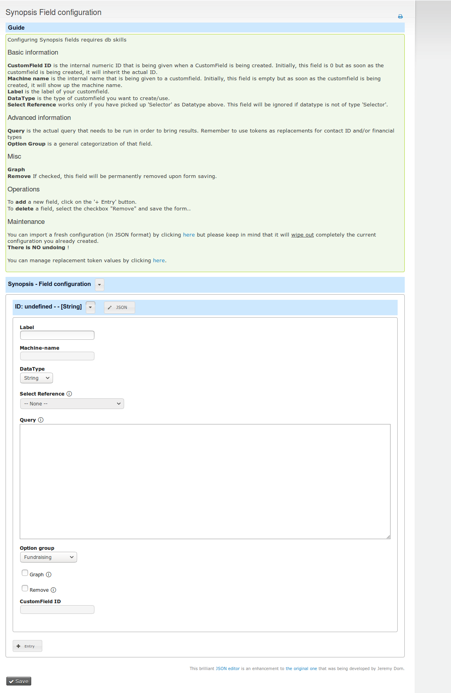
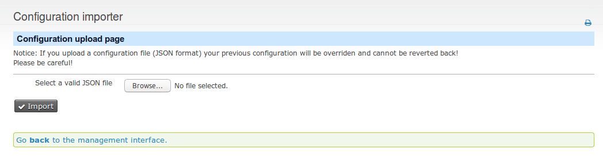
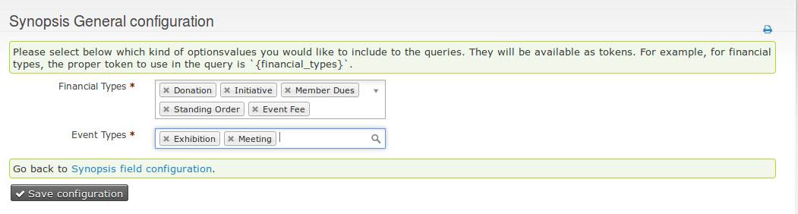

# synopsis

This is an extension similar (but not identical) to the SummaryFields extension. You can define dynamically CustomFields for contacts along with their associated MySQL query for their values.

Features:

* Ability to add/remove on-the-fly new fields via the UI
* Ability to use Optionvalues via selector data-types as displaying results (for example First Contribution Campaign)
* Ability to refresh stats for a specific contact (via UI button)
* Ability to import an initial configuration via the JSON importer (included)
* Fields are accessible on advanced search and on reports instantly

The extension is licensed under [AGPL-3.0](LICENSE.txt).

## Screenshots


Field configuration



Configuration importer



Token configuration



## Requirements

* PHP v7+
* CiviCRM 5.x

## Installation (Web UI)

This extension has not yet been published for installation via the web UI.

## Installation (CLI, Git)

Sysadmins and developers may clone the [Git](https://git.ixiam.com/civicrm/synopsis) repo for this extension and
install it with the command-line tool [cv](https://github.com/civicrm/cv).

```bash
git clone git@git.ixiam.com:civicrm/synopsis.git
cv en synopsis
```

## Usage

Upon a successful installation of this extension, declare your fields under Administer > Customize data and screens > Synopsis fields

* **CustomField ID** is the internal numeric ID that is being given when a CustomField is being created. Initially, this field is 0 but as soon as the customfield is being created, it will inherit the actual ID that is being stored in the DB. This field is **disabled** from editing.
* **Machine name** is the internal name that is being given to a CustomField. Initially, this field is empty but as soon as the CustomField is being created, it will show up the machine name. This field is **disabled** from editing.
* **Label** is the label of your CustomField.
* **DataType** is the type of CustomField you want to create/use.
* **Select Reference** works only if you have picked up 'Selector' as Datatype above. This field will be ignored if datatype is not of type 'Selector'.
* **Query** The MySQL query that will be used to calculate this field.
* **OptionGroup** Leave it as 'FundRaising'. No use at the moment.
* **Graph** No use at the moment.
* **Remove** By checking this checkbox and saving the form, this specific entry (and associated CustomField) will be completely removed from the system. Be careful!

When you write an SQL query, always remember to add the token of contact_id by adding {contact_id}.

Saving the form will create the added fields into CiviCRM.

Further tokens include:
* {financial_types} : Financial type IDs to include. Configurable under: `/civicrm/admin/settings/synopsis/config`
* {current_fiscal_year_begin}
* {current_fiscal_year_end}
* {last_fiscal_year_begin}
* {last_fiscal_year_end}
* {year_before_last_fiscal_year_begin}
* {year_before_last_fiscal_year_end}

Synopsis is coming with its own API that you can add as a scheduled job.
You can also call it via drush: `drush cvapi Synopsis.calculate`

If you add the parameter `contact_id=<contact_id>` to the API call above, it will calculate only for that contact ID supplied.

Example:
`drush cvapi Synopsis.calculate contact_id=1234`

## Known Issues

Plenty, follow: https://git.ixiam.com/civicrm/synopsis/issues

## Todo

* Add graphs (Chart.js) on a separate tab
* Proper weight control

## Credits

Many thanks to Jamie McClelland and his excellent [SummaryFields extension](https://civicrm.org/extensions/summary-fields) (Git repo [link](https://github.com/progressivetech/net.ourpowerbase.sumfields.git)).
A big part of the source code and his ideas are being borrowed by his extension.